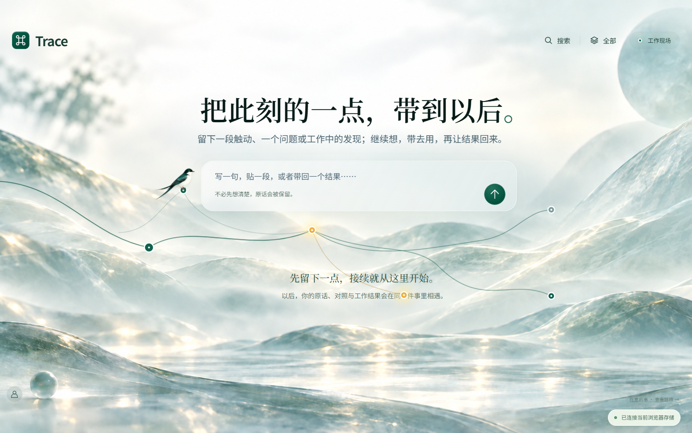
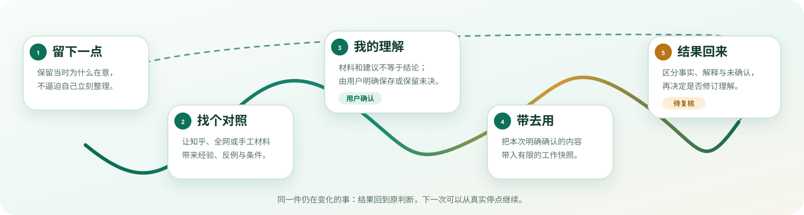

# Trace

## 让重要但未完成的想法，继续发生。

**Trace Runtime** 是一个 local-first 的连续思考工作空间。

它不把收藏、聊天、任务和 AI 回答堆成更多孤立记录；它把一条还没有想清楚的线索，沿着 **原始表达 → 真实材料 → 用户确认的理解 → 一次实践 → 结果回流**，保留为同一件仍然可以变化的事。

<p align="center">
  <strong>知乎黑客松作品方向</strong> · local-first · 来源可回看 · 理解须确认 · 行动有边界
</p>

<p align="center">
  <a href="#judge-demo">3 分钟评委演示</a> ·
  <a href="#what-is-trace">30 秒看懂</a> ·
  <a href="#run-locally">本机运行</a> ·
  <a href="docs/product-guide.md">产品指南</a> ·
  <a href="docs/architecture.md">架构与边界</a>
</p>


<p align="center"><sub>产品概念插画：说明“一件事持续演化”的设计意图；不是当前运行界面，也不代表功能完成状态。</sub></p>

> **评委先记住这一点：** Trace 不试图替用户更快地下结论；它让用户能看见一条判断为什么开始、遇到了什么、怎样变化，又如何被真实结果修订。

### 当前本机 Web 界面



<a id="what-is-trace"></a>
## 30 秒看懂：Trace 解决的是「判断断裂」

今天的信息工具很擅长收集，却经常让一条重要的判断在下一步断掉：

| 断点 | 常见结果 | Trace 的取舍 |
| --- | --- | --- |
| 收藏失去语境 | 几周后只剩标题，忘了当时为何在意 | 原话与材料回到同一件事里 |
| AI 对话失去背景 | 换一个任务又要重述限制、犹豫和上下文 | 只带入本次明确确认的内容与快照 |
| 实践没有回流 | 做完一次尝试，原来的理解仍停在旧版本 | 结果先回到待复核区，再由用户决定是否修订 |

Trace 的核心对象不是笔记、聊天或待办，而是：

> **一件仍在变化的事。**

```text
留下一点 ──→ 找个对照 ──→ 我的理解 ──→ 带去用 ──→ 结果回来
     ↑                                                        │
     └──────── 同一件事继续变化，而不是另起一份记录 ────────┘
```



<sub>闭环说明图：表示 Trace 的产品模型与确认边界；具体界面和接入完成度以本 README 的“现在可以验证什么”和“当前不可声称什么”为准。</sub>

这也是它和“AI 搜索 + 笔记”的区别：**搜索结果不是结论，模型回答不是理解，完成一次任务也不是验证结束。**

<a id="judge-demo"></a>
## 3 分钟评委演示：从一句困惑到可复核的下一步

建议先按下面路线体验产品，而不是先阅读 API。每一步都有可观察的产品状态与明确的边界。

| 步骤 | 评委实际做什么 | 能看到什么 | 它证明什么 |
| --- | --- | --- | --- |
| 1. 留下一点 | 写下一句尚未整理的困惑，例如“收藏的经验为什么总用不起来？” | 原表达成为一件事的起点，而不是强制填写的表单 | Trace 从未完成的想法开始 |
| 2. 让它遇到材料 | 在本机开启知乎／全网面板后检索一个具体问题 | 标题、作者、接口摘要、原始链接；没有虚构正文或链接 | 来源与判断分开，材料可回看 |
| 3. 保留判断权 | 阅读材料后写下自己的理解，或保留不确定性 | 搜索不会改写事项；只有明确保存才进入产品状态 | AI 和来源不能越权替用户下结论 |
| 4. 带去一次行动 | 创建一份受限工作快照，或用 Codex 工作往返 | 输入范围、上下文和结果记录各自可追溯 | 行动使用的是明确确认过的上下文 |
| 5. 让结果回来 | 记录事实、解释和仍未确认的部分 | 结果回到待复核区，不直接覆盖旧理解 | 实践可以修订判断，但不能伪造结论 |

### 两种体验入口，请不要混淆

| 入口 | 适合什么 | 当前能验证什么 | 数据边界 |
| --- | --- | --- | --- |
| [在线产品预览](https://trace-portal.vercel.app) | 快速体验“留下一点 → 理解 → 行动 → 结果”的手工闭环 | 浏览器中的手工产品流程 | 当前浏览器 IndexedDB；**不**自动连接本机 SQLite、知乎、Agent 或 Codex |
| 本仓库的本机 Web | 评委演示来源、产品状态、Codex 工作回流及可选 Agent API | SQLite、知乎／全网 provider、受控 Agent Runtime | 单用户、loopback、same-origin；详见下方运行方式 |

<a id="zhihu"></a>
## 知乎在 Trace 中：让判断遇到真实经验，而不是多一个搜索框

知乎为 Trace 提供的是“真实经验与公共讨论”的来源层。它不会自动变成用户的观点，也不会被 Agent 伪造成引用。

| 能力 | 评委现在可以验证 | 状态与边界 |
| --- | --- | --- |
| **知乎搜索** | 围绕一个具体问题查看标题、作者、摘要与原始链接 | 需在本机配置 Access Secret；只展示 provider 返回的摘要，不冒充全文 |
| **全网搜索** | 与知乎搜索分开调用，补充或反驳当前判断 | 固定路由和受限筛选；端点已连通，但非知乎站点覆盖仍待更多验收 |
| **用户授权** | 用户主动连接后，按需读取自己的创作、关注、近期收藏、收藏夹及其中内容 | OAuth 与公共搜索分离；每次只读用户选择的 3 条，不自动翻页、保存，也不拿开发者身份代替用户 |
| **Agent 检索** | 在网页的一件事中发起 Agent run，并为这一次显式勾选知乎／全网工具 | 默认关闭；调用次数、结果条数、来源和引文均受限并被宿主记录 |

```text
/api/product/*  ─── 事项、理解、确认后的产品状态
/api/search/*   ─── 知乎搜索与全网搜索（公共内容）
/api/zhihu/*    ─── 知乎 OAuth、连接状态、授权后的用户数据
/api/agent/*    ─── 受控生成、来源工具、运行事件与取消
```

> **重要：** 当前已经实现“真实查询与摘要展示 → 用户选择一条 → 放入对照 → 用户确认关系 → 保存到同一事项”。选入材料与确认关系都不会自动改写“我的理解”；修改理解仍是另一项明确动作。

配置、OAuth relay、MCP 工具、接口协议与真实验收边界请看 [知乎与全网接入](docs/zhihu-native.md)。

## 现在可以验证什么

| 能力 | 可观察证据 | 不应误解为 |
| --- | --- | --- |
| 产品状态 | SQLite 命令、revision CAS、幂等回放和显式保存 | 浏览器能直接覆盖整份用户状态 |
| 真实来源 | 标题、作者、摘要、真实 URL、受限 provider 路由 | 搜索内容已经自动进入“我的理解” |
| Agent Runtime | 网页控制器、profile、SSE、取消、超时、过期保护、候选确认／放弃／撤销与独立 `agent.sqlite` | Agent 可以自动改写用户的正式理解 |
| Codex 工作往返 | 用户确认的工作快照、结果回传与待复核状态 | Codex 的结果已自动修订用户理解 |
| 凭证隔离 | 密钥／Token 不进入浏览器 JS、MCP 输入、模型上下文或产品库 | 任意云端或多用户部署已经就绪 |

## 当前不可声称什么

Trace 选择把未完成项写在 README，而不是用模糊的“即将上线”掩盖它们：

- **线上 OAuth 回调尚未验收**：登记域名仍需要部署长驻 callback relay；静态页面返回不是授权成功。
- **不是公网多用户服务**：本机 Web／OAuth 为单用户 loopback + same-origin 设计。
- **尚未完成生产发行与运维闭环**：Web/Agent 打包、备份恢复、运行归档和安全远程连接仍在推进。

完整能力状态、验证方法和缺口见 [生产化计划](docs/production-plan.md)。

## 为什么 Trace 能保住用户的判断权

```text
                           ┌─────────────────────────────────────┐
                           │            Trace Web                │
                           │  一件事 / 材料 / 理解 / 工作现场     │
                           └──────────────┬──────────────────────┘
                                          │ loopback + same-origin
         ┌────────────────────────────────┼────────────────────────────────┐
         │                                │                                │
 /api/product/*                    /api/search/*                    /api/agent/*
 产品命令与 SQLite                  ZhihuProvider                    AgentService
 revision / 回执                    知乎 / 全网摘要                  profile / SSE / 取消
         │                                │                                │
     web.sqlite                 /api/zhihu/*                    agent.sqlite
                                OAuth / 用户数据                 候选与运行账本
                                         │                                │
                                  本机 MCP / Codex  ←─────────────┘
```

四条不可跨越的边界：

1. **产品库只接受明确命令。** 搜索、模型和 Agent 不能绕过确认流程写入用户理解。
2. **来源 provider 与模型 provider 分离。** 知乎 transport 负责鉴权、限流、摘要和真实 URL，不负责替用户推断结论。
3. **Agent 只获得本次授权。** 上下文、来源、工具调用和预算均为 run-scoped；它不能自行打开 shell、任意 URL、文件或知乎用户数据。
4. **凭证不穿过产品表面。** Access Secret、App Key 与 OAuth Token 不进入浏览器、MCP tool 参数、模型上下文或产品 SQLite。

详细模块职责、数据 owner 与远程化边界在 [架构文档](docs/architecture.md)。

<a id="run-locally"></a>
## 本机运行：评委的完整演示路径

**前置条件：** Node `>= 22.13` 与 pnpm `>= 10.34.5`。本仓库使用 pnpm workspace。

```sh
corepack pnpm install --frozen-lockfile
corepack pnpm start
```

终端会打印本机地址（默认 `http://127.0.0.1:4173`）和 SQLite 路径。打开后可直接体验手工闭环；`Ctrl+C` 只停止当前启动的服务。

### 可选：接入知乎／全网

1. 按 [知乎配置说明](docs/zhihu-native.md#配置本机服务) 将 Access Secret 注入**本机后端进程环境**，并设置 `TRACE_ZHIHU_ENABLED=1`。
2. 重启 `corepack pnpm start`，在「个人与设置 → 知乎与全网」检索一个具体问题。
3. 切换“知乎”和“全网”，检查结果中的来源摘要与真实链接；它们不会写入产品状态。
4. 仅当你明确希望读取自己的知乎内容时，再配置 OAuth 并自行完成浏览器授权。

### 可选：开放 Agent API

```sh
corepack pnpm start -- --agent
```

这会开启本机 Agent API，并在“一件事／对照／工作现场”显示「问 Agent」入口；仍不会自动发起模型请求或改变正文。一次请求若要使用来源检索，必须在页面勾选或在 API 中显式授予：

```json
{"retrieval":{"sources":["zhihu","global"]}}
```

启动检查、端口、数据库、profile 和安全停用请看 [本机运行手册](docs/local-runtime.md) 与 [Agent 协议](apps/agent/docs/protocol.md)。

### 可选：连接 Codex

Windows 用户可在 Trace 安装目录双击 `Connect-Trace-to-Codex.cmd`。启动器会先展示安装计划并要求确认，再连接本地 Plugin 与 MCP；它不会替你初始化项目、读取认知源或自动修改理解。源码 checkout 用户也可以按 [Codex Plugin 文档](docs/codex-plugin.md) 使用等价的 Node 命令完成预览和安装。

## 按你的目的继续

| 你是谁 / 想做什么 | 从这里开始 |
| --- | --- |
| 评委或产品体验者：理解六个核心动作与使用场景 | [产品指南](docs/product-guide.md) |
| 想验证知乎搜索、全网、OAuth、MCP 和 Agent 检索 | [知乎与全网接入](docs/zhihu-native.md) |
| Web / 后端开发者：了解 API 域、数据 owner 与服务边界 | [底层架构](docs/architecture.md) |
| 想发起、订阅或取消一次 Agent run | [Agent 协议](apps/agent/docs/protocol.md) |
| 想配置模型或完整外部 Agent | [Agent profiles](apps/agent/docs/profiles.md) |
| 想在 Codex 中领取 Trace 工作并回传结果 | [Codex Plugin](docs/codex-plugin.md) |
| 想贡献源码或查找全部说明 | [文档导航](docs/README.md) |

## 开发与贡献

```sh
corepack pnpm build
node --test tests/zhihu-native.test.mjs tests/agent-retrieval.test.mjs tests/agent-backend.test.mjs
```

`pnpm build` 编译 CLI/MCP runtime 并执行 TypeScript 构建检查；它不代表 Web/Agent 已被打包为生产发行物。变更接口、来源或运行边界时，请同步更新对应文档与定向测试。

不要提交 Access Secret、App Key、OAuth Token、真实用户内容或本地 `artifacts/` 验证材料。

---

**Trace 不要求你先想清楚。先留下一点；下一次，重要的事还有地方可以接着。**
